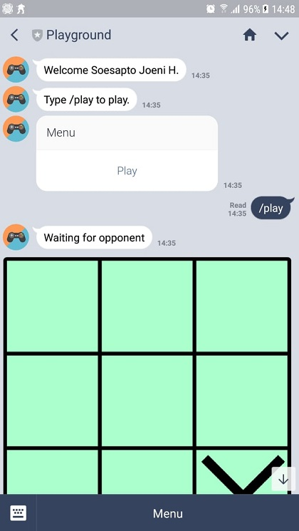
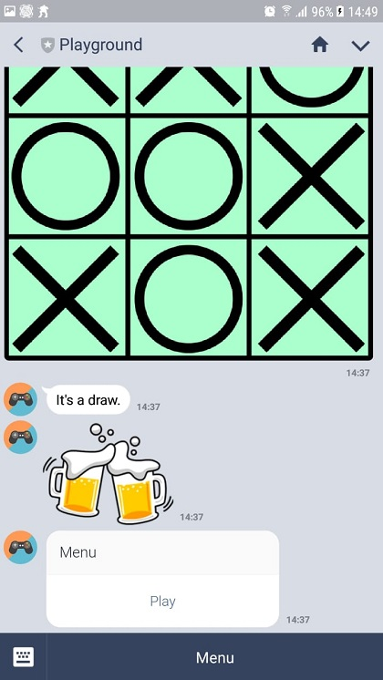

# TicTacToe
TicTacToe multiplayer game

# File Structure

/--apps/TicTacToe.php

/--samples/bg_ttt.png

/--samples/o.png

/--samples/x.png

/--image.php

# Notes

Change $imageUrl variable on TicTacToe.php to match your server. 

Import table.sql to the MySQL server.